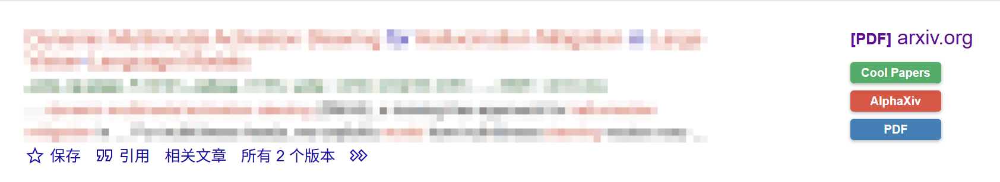
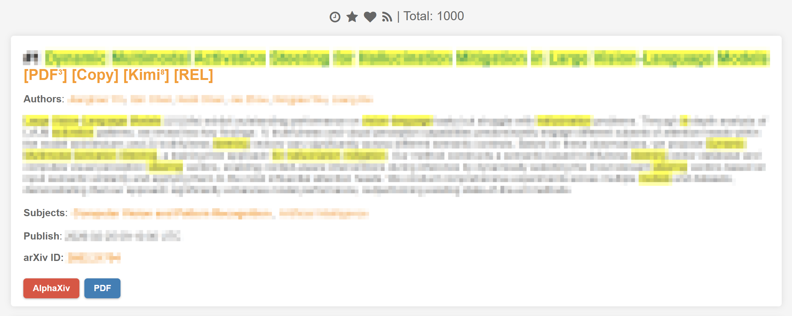
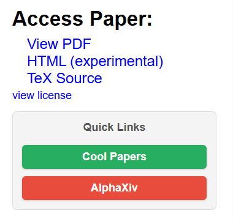
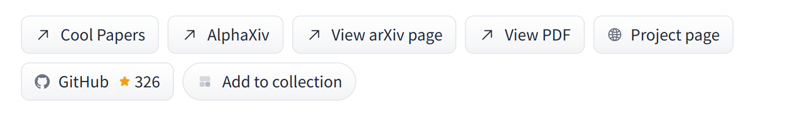

# Research Tools Scripts

一些自制的用于辅助科研搜索与论文阅读的油猴脚本。

## 🚀 脚本列表

| 脚本名称 | 功能描述 | 安装链接 |
| :--- | :--- | :--- |
| **Google Scholar Enhanced** | 在谷歌学术搜索结果页添加 Cool Paper、AlphaXiv 和 PDF 的跳转按钮。 | [立即安装](https://cdn.jsdelivr.net/gh/Cu-OH-2/research-tools-scripts@master/google-scholar-enhanced/google-scholar-enhanced.user.js) |
| **Cool Paper Enhanced** | 在 Cool Paper 论文列表页添加 arXiv ID 显示以及 AlphaXiv 和 PDF 的跳转按钮。 | [立即安装](https://cdn.jsdelivr.net/gh/Cu-OH-2/research-tools-scripts@master/cool-papers-enhanced/cool-papers-enhanced.user.js) |
| **arXiv Enhanced** | 在 arXiv abs 页面添加 Cool Paper 和 AlphaXiv 的跳转按钮。 | [立即安装](https://cdn.jsdelivr.net/gh/Cu-OH-2/research-tools-scripts@master/arxiv-enhanced/arxiv-enhanced.user.js) |
| **HuggingFace Papers Enhanced** | 在 HuggingFace 论文页面添加 Cool Papers 和 AlphaXiv 的跳转按钮。 | [立即安装](https://cdn.jsdelivr.net/gh/Cu-OH-2/research-tools-scripts@master/huggingface-papers-enhanced/huggingface-papers-enhanced.user.js) |

## 📸 功能展示

### 1. Google Scholar Enhanced

在搜索结果右侧嵌入快捷跳转按钮，支持 arXiv 论文自动识别。

  

### 2. Cool Paper Enhanced

补全 Cool Paper 缺失的 arXiv ID 信息，并提供一键跳转阅读/讨论功能。

  

### 3. arXiv Enhanced

在 arXiv 文章的 abs 页面的右侧栏添加一键跳转阅读/讨论功能。

  

### 4. HuggingFace Papers Enhanced

在 HuggingFace 论文详情页面添加与原生风格一致的 Cool Papers 和 AlphaXiv 的快捷跳转按钮。

  

## 🛠 安装与使用

1.  首先确保浏览器已安装 [Tampermonkey](https://www.tampermonkey.net/) 扩展。
2.  点击上方表格中的 **“立即安装”** 链接。
3.  在弹出的油猴确认页面点击 **“安装”** 即可。
4.  刷新对应的网站，即可看到增强效果。